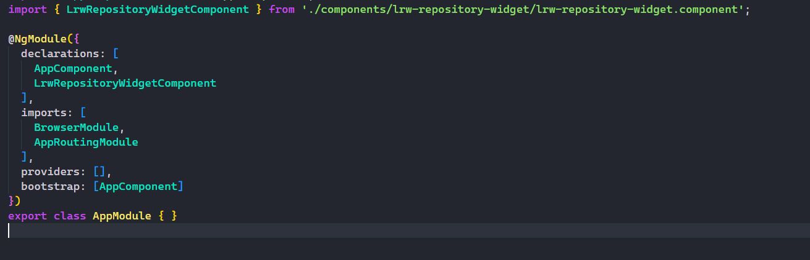

## example

Inside the **"example"** folder, you will find an Angular project where the widget is being embedded as a component. You can clone the repository and see how it is being used. You will find more information within the README.md.

## components

Inside the **components** folder, you will find the **"lrw-repository-widget"** component configured and ready to be integrated into your project. For more information, you can refer to the README.md within the component

## Last and optional configurations

Inside the *.ts* file, you can configure the widget parameters by editing the **'public'** variables. The component is fully responsive, but if you want to change the **height**, you can do so within the *.css* file.