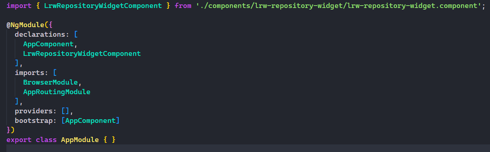

# Installation 

You can install the **'lrw-repository-widget'** component within your preferred Angular module by navigating to the 'components' folder inside the module and placing the 'lrw-repository-widget' folder there.

Within that folder, you will find three files: a *.ts*, an *.html*, and a *.css* file.

## Declaration of the component

To declare the component in your module, go to the .module.ts file and expose the **'LrwRepositoryWidgetComponent'** component.

## Last and optional configurations

Inside the *.ts* file, you can configure the widget parameters by editing the **'public'** variables. The component is fully responsive, but if you want to change the **height**, you can do so within the *.css* file.